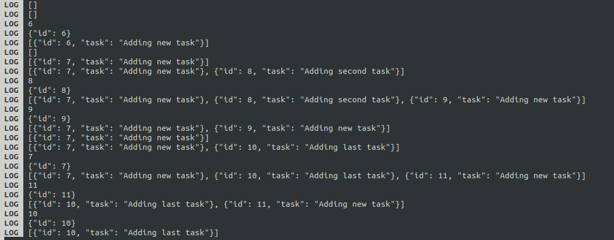

# TaskApp-React
## Currently out of service for sdk mismatch of 47.0.0 or 48.0.0 and 49.0.0.New React-Native policy allowing android security to stop apps.
## Demo:-
https://github.com/Arghajit08/TaskApp-React/assets/89945847/6c41979a-98fc-475f-b24f-66a4217c608c
## Corresponding Logs Data:-
<center>

</center>


## Installation Process:-
## 1.Install NPM(UBUNTU)
```
sudo apt install nodejs
```
```
sudo apt install npm
```
```
sudo apt install nodejs
```
## 2.Initiate APP
```
npx init (appname)
```
## 3.Incase of version error(To Upgrade NPM)
```
sudo npm install -g n
```
```
sudo n latest
```
```
npx expo init (appname)
```
## 4.Start APP through EXPO-CLI
```
npx expo start
```
## 5.Scan QrCode in android expo app to debug app 
## 6.Login to Expo Account
```
npx expo login
```
## 7.Build the APP
```
eas build -p android --profile preview
```
## 8.Build will be added to the queue

## 9. API LINK(Made with Django):- https://api-34jp.onrender.com/

## 10.API Creation Repo:- https://github.com/Arghajit08/todoreactapi
